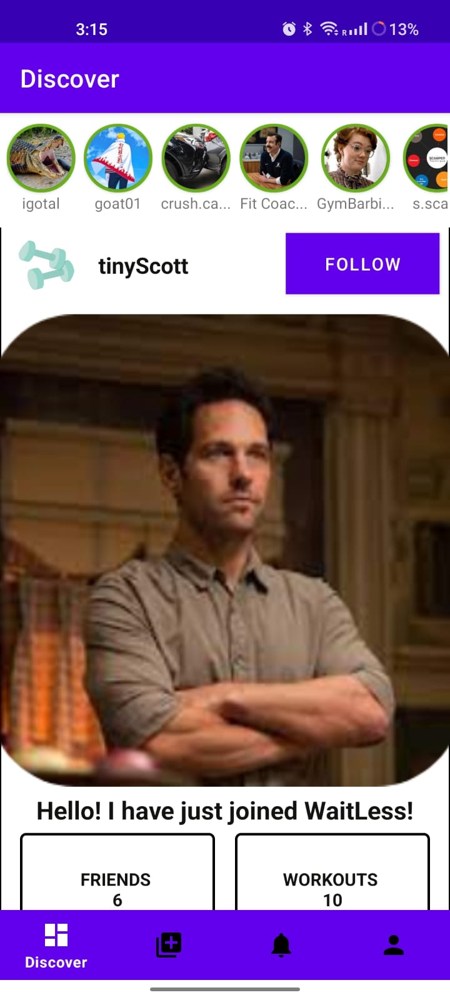
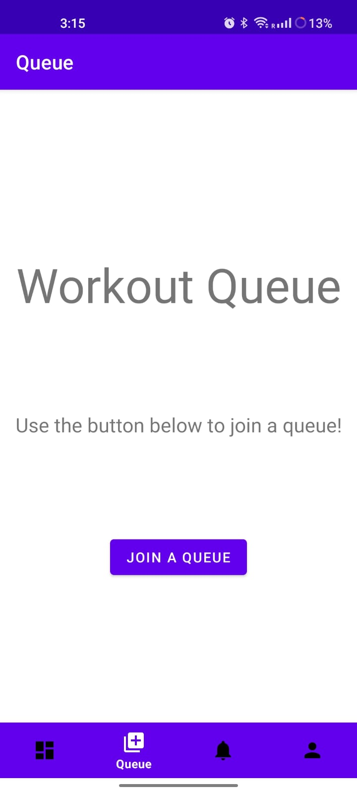
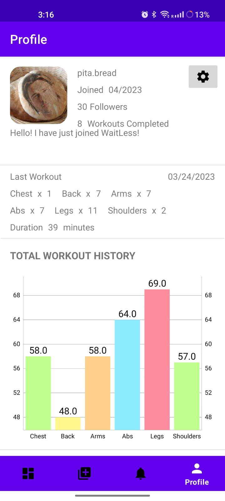

# WaitLess_MobileApp

# App Description

Say goodbye to long queues and wasted gym time with WaitLess, the ultimate
resource-sharing platform for gym enthusiasts. This innovative app revolutionizes the gym
experience, making it more time efficient and enjoyable. Say hello to real-time equipment
availability, join a queue simply by scanning a machine’s QR code, and receive notifications
when it's your turn to workout. With the app's stretching tips, you can stay active and focused
even during wait times, ensuring that every minute at the gym is well-spent.
But WaitLess is more than just a queue management system, it's a community. Connect with and
message other gym-goers around you, view their workout profiles, and find a connection to help
push you to your limits. Track your progress with ease, enter your lifts and see your progress
over time with WaitLess's interactive tracking graph. Whether you're a seasoned fitness
enthusiast or just starting out, this app is the perfect tool to help you reach your goals. Don't wait
any longer, download WaitLess today and join the revolution!

# Screens For WaitLess App
1. Main Screen – Discover Page  

2. Queuing Page  

3. Profile Page 

4. Notifications Page  

# Target Users
The target users for this app consists of fitness enthusiasts who frequent gyms and
are seeking a more efficient and convenient experience. These individuals are looking for ways
to maximize their time at the gym and are seeking to reduce wait times for equipment. This
includes seasoned gym-goers who have a regular workout routine and are looking to streamline
their gym experience, as well as individuals who are just starting out on their fitness journey.
Additionally, the app's social features, such as the ability to connect with other users and find
workout partners, make it appealing to those who are looking to be a part of a fitness community.
Lastly, this app will be attractive to gym owners who wish to increase their membership capacity
without the need to invest in new equipment or additional locations.
